# ESPHome

*ESPHome is a system to control your microcontrollers by simple yet powerful configuration files and control them remotely through Home Automation systems.*

## Resources

- [ESPHome documentation](https://esphome.io)
- [DockerHub](https://hub.docker.com/r/esphome/esphome)
- [GitHub](https://github.com/esphome/feature-requests)

## IOTstack service definition {#serviceDefinition}

``` yaml linenums="1"
esphome:
  container_name: esphome
  image: esphome/esphome
  restart: unless-stopped
  environment:
    - TZ=${TZ:-Etc/UTC}
    - USERNAME=${ESPHOME_USERNAME:-esphome}
    - PASSWORD=${ESPHOME_PASSWORD:?eg echo ESPHOME_PASSWORD=ChangeMe >>~/IOTstack/.env}
  network_mode: host
  x-ports:
    - "6052:6052"
  volumes:
    - ./volumes/esphome/config:/config
  device_cgroup_rules:
    - 'c 188:* rw'
```

Notes:

1. The container runs in "host" mode, meaning it binds to the host port 6052.
2. The `x-` prefix on the `x-ports` clause has the same effect as commenting-out lines 10 and 11. It serves the twin purposes of documenting the fact that the ESPHome container uses port 6052 and minimising the risk of port number collisions.

## Container installation

### via the IOTstack menu

If you select ESPHome in the IOTstack menu, as well as adding the [service definition](#serviceDefinition) to your compose file, the menu:

1. Copies a rules file into `/etc/udev/rules.d`.
2. Checks `~/IOTstack/.env` for the presence of the `ESPHOME_USERNAME` and initialises it to the value `esphome` if it is not found.
3. Checks `~/IOTstack/.env` for the presence of the `ESPHOME_PASSWORD` and initialises it to a random value if it is not found.

### manual installation {#manualInstall}

If you prefer to avoid the menu, you can install ESPHome like this:

1. Be in the correct directory:

	``` console
	$ cd ~/IOTstack
	```

2. If you are on the "master" branch, add the service definition like this:

	``` console
	$ sed -e "s/^/  /" ./.templates/esphome/service.yml >>docker-compose.yml
	```

	Alternatively, if you are on the "old-menu" branch, do this:

	``` console
	$ cat ./.templates/esphome/service.yml >>docker-compose.yml
	```

3. Replace `«username»` and `«password»` in the following commands with values of your choice and then run the commands:

	``` console
	$ echo "ESPHOME_USERNAME=«username»” >>.env
	$ echo "ESPHOME_PASSWORD=«password»" >>.env
	```

	This initialises the required environment variables. Although the username defaults to `esphome`, there is no default for the password. If you forget to set a password, `docker-compose` will remind you when you try to start the container:

	```
	error while interpolating services.esphome.environment.[]: \
	  required variable ESPHOME_PASSWORD is missing a value: \
	  eg echo ESPHOME_PASSWORD=ChangeMe >>~/IOTstack/.env
	```

	The values of the username and password variables are applied each time you start the container. In other words, if you decide to change these credentials, all you need to do is edit the `.env` file and “up” the container.

4. Copy the UDEV rules file into place and ensure it has the correct permissions:

	``` console
	$ sudo cp ./.templates/esphome/88-tty-iotstack-esphome.rules /etc/udev/rules.d/
	$ sudo chmod 644 /etc/udev/rules.d/88-tty-iotstack-esphome.rules
	```

## A quick tour

ESPHome provides a number of methods for provisioning an ESP device. These instructions focus on the situation where the device is connected to your Raspberry&nbsp;Pi via a USB cable.

### start the container

To start the container:

``` console
$ cd ~/IOTstack
$ docker-compose up -d esphome
```

Tip:

*  You can always retrieve your ESPHome login credentials from the `.env` file. For example:

	``` console
	$ grep “^ESPHOME_” .env
	ESPHOME_USERNAME=esphome
	ESPHOME_PASSWORD=8AxXG5ZVsO4UGTMt
	```

### connect your ESP device

Connect your ESP device to one of your Raspberry&nbsp;Pi’s USB ports. You need to connect the device *while* the ESPHome container is running so that the [UDEV rules file](#udevRules) can propagate the device (typically `/dev/ttyUSBn`) into the container.

So long as the container is running, you can freely connect and disconnect ESP devices to your Raspberry&nbsp;Pi’s USB ports, and the container will keep “in sync”.

### in your browser

Launch your browser. For maximum flexibility, ESPHome recommends browsers that support *WebSerial*, like Google Chrome or Microsoft Edge.

1. Connect to your Raspberry&nbsp;Pi on port 6052 (reference point <!--A-->&#x1F130; in the following screen shot):

	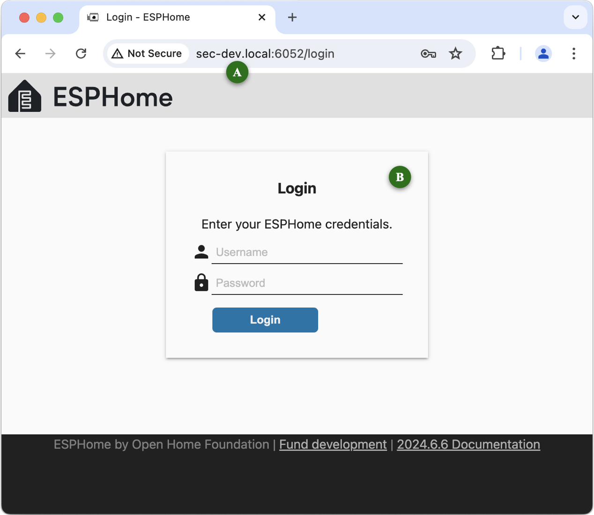

	You can use your Raspberry&nbsp;Pi’s:

	* multicast domain name (eg `raspberrypi.local`);
	* IP address (eg 192.168.1.100); or
	* domain name (if you run your own Domain Name System server).

2. Enter your ESPHome credentials at <!--B-->&#x1F131; and click <kbd>Login</kbd>.

3. Click either of the <kbd>+ New Device</kbd> buttons <!--C-->&#x1F132;:

	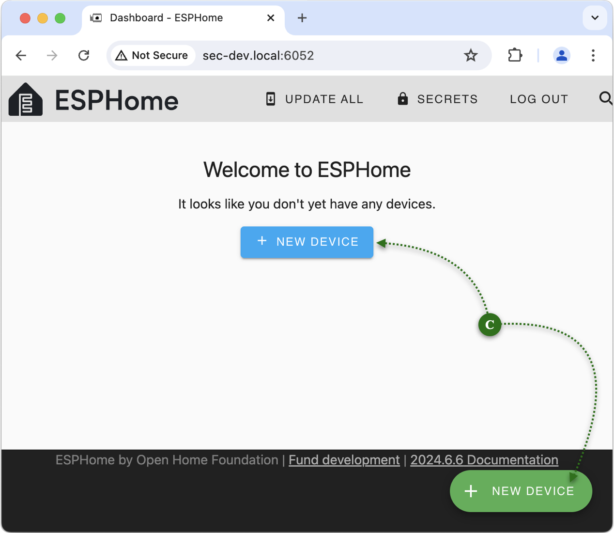

	Read the dialog and then click <kbd>Continue</kbd> <!--D-->&#x1F133;:

	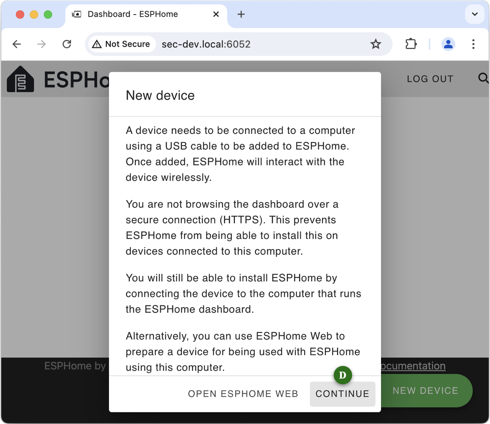

4. Give the configuration a name at <!--E-->&#x1F134;:

	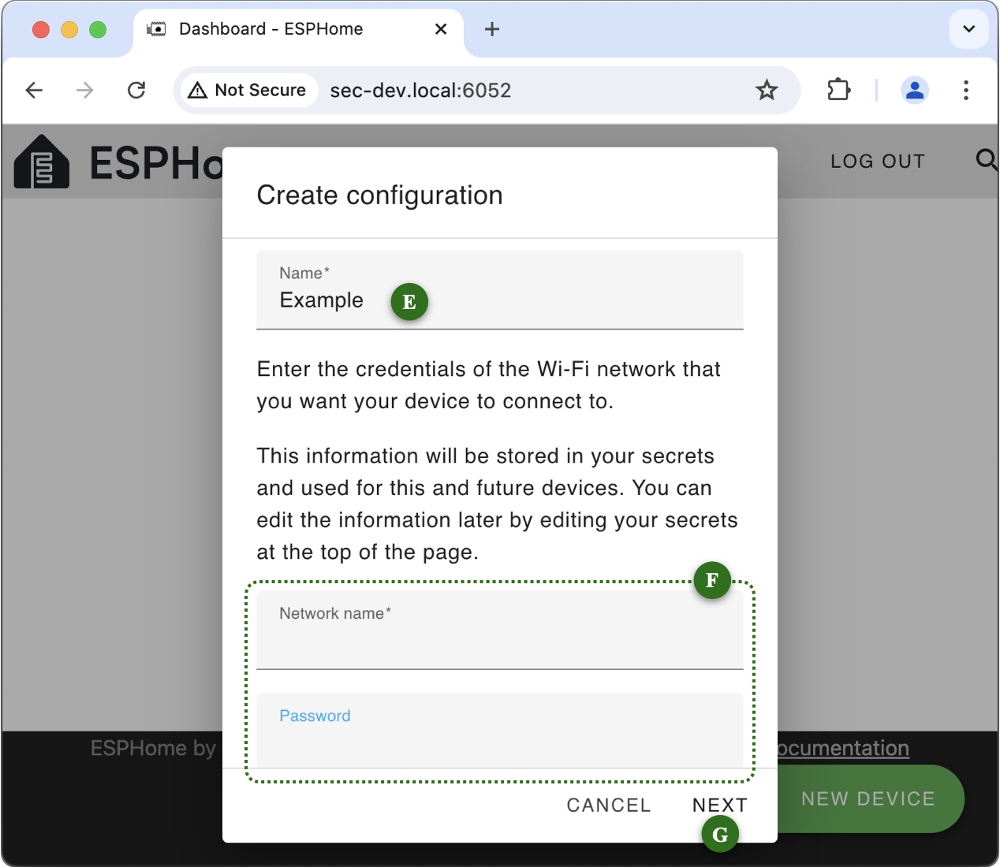

	In the fields at <!--F-->&#x1F135;, enter the Network Name (SSID) and password (PSK) of the WiFi network that you want your ESP devices to connect to when they power up.

	> The WiFi fields are only displayed the very first time you set up a device. Thereafter, ESPHome assumes all your devices will use the same WiFi network.

	Click “Next” <!--G-->&#x1F136;.

5. Select the appropriate SoC (System on a Chip) type for your device. Here, I am using a generic ESP32 at <!--H-->&#x1F137;:

	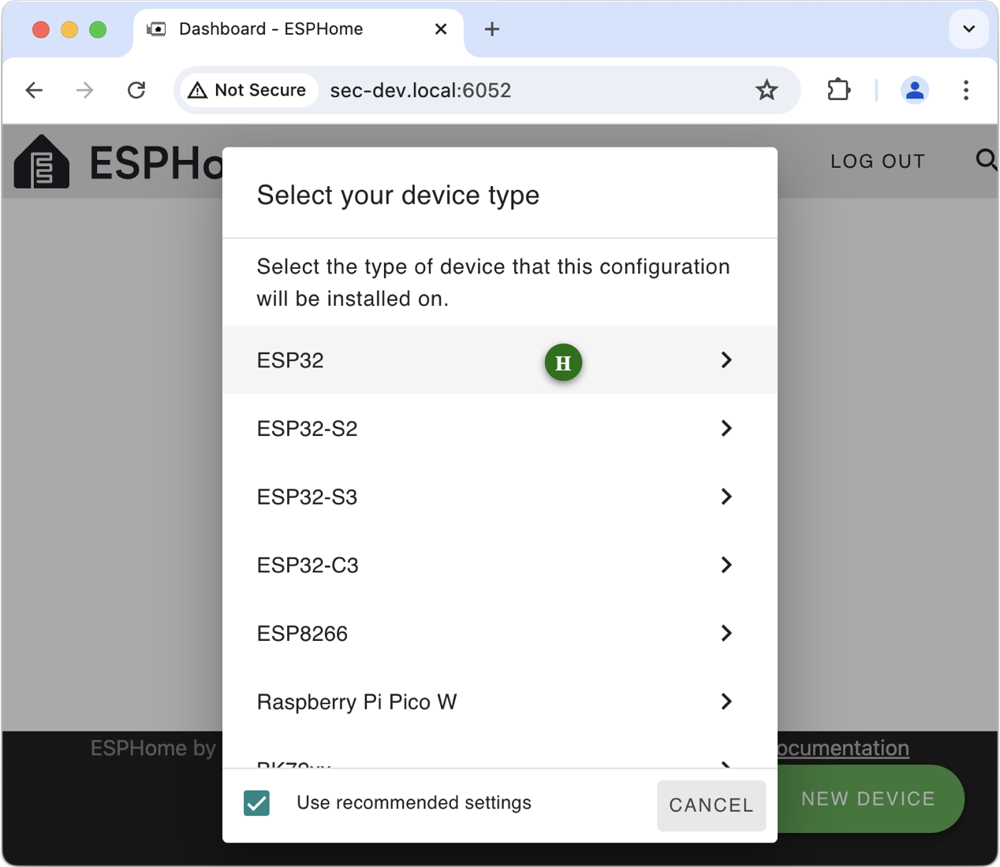

	Clicking on the appropriate line proceeds to the next step.

6. You can either make a note of the encryption key or, as is explained in the dialog, defer that until you actually need it for Home Assistant. Click “Install” <!--I-->&#x1F138;.

	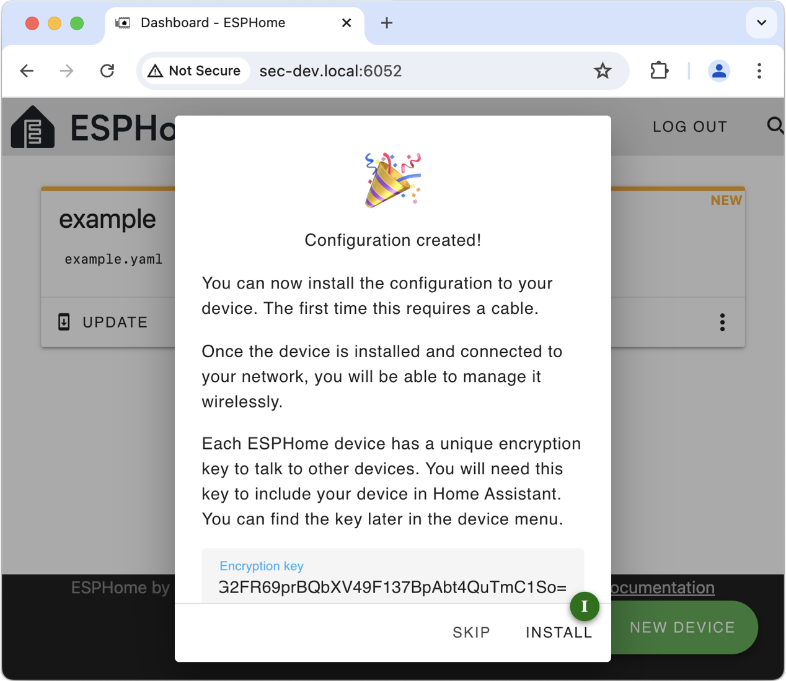

7. The primary reason for running ESPHome as a container in IOTstack is so you can program ESP devices attached to your Raspberry&nbsp;Pi. You need to tell ESPHome what you are doing by selecting “Plug into the computer running ESPHome Dashboard” <!--J-->&#x1F139;:

	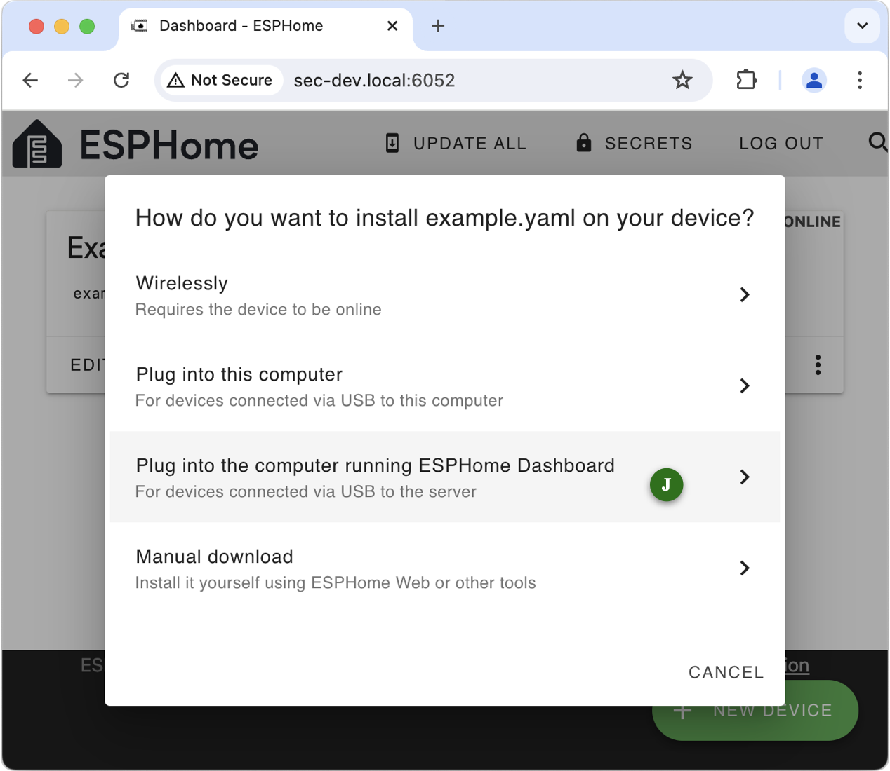

8. If all has gone well, your device will appear in the list. Select it <!--K-->&#x1F13A;:

	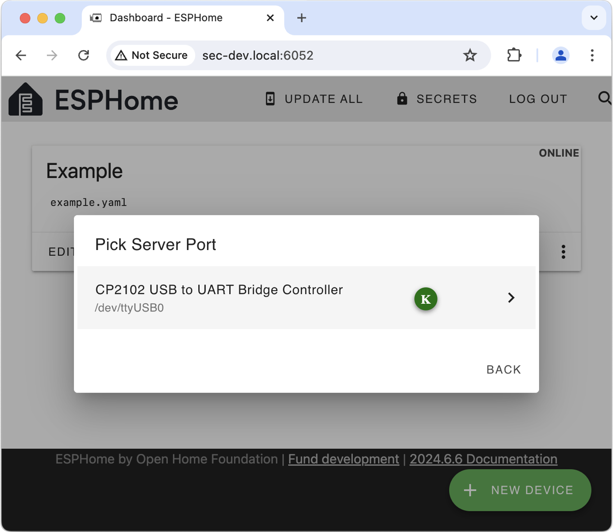

	If, instead, you see the window below, it likely means you did not connect your ESP device *while* the ESPHome container was running:

	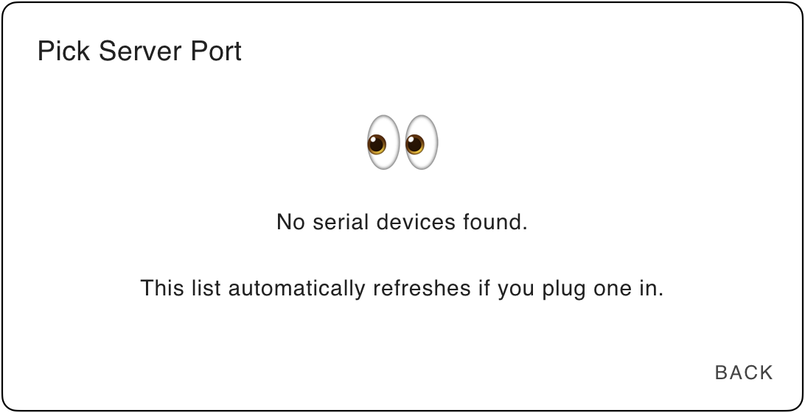

	Try disconnecting and reconnecting your ESP device, and waiting for the panel <!--K-->&#x1F13A; to refresh. If that does not cure the problem then it likely means the [UDEV rules](#udevRules) are not matching on your particular device for some reason. You may need to consider [privileged mode](#privileged).

9. The container will begin the process of compiling the firmware and uploading it to your device. The first time you do this takes significantly longer than second-or-subsequent builds, mainly because the container downloads almost 2GB of data.

	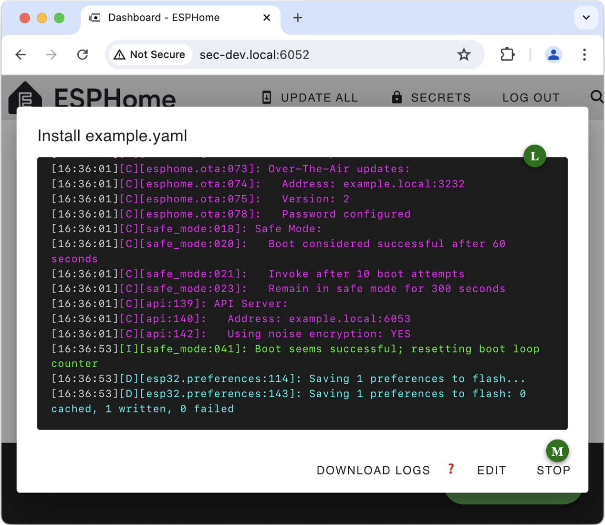

	The time to compile depends on the speed of your Raspberry&nbsp;Pi hardware (ie a Raspberry&nbsp;Pi 5 will be significantly faster than a model 4, than a model 3). Be patient!

	When the progress log <!--L-->&#x1F13B; implies the process has been completed, you can click <kbd>Stop</kbd> <!--M-->&#x1F13C; to dismiss the window.
	
10. Assuming normal completion, your ESP device should show as “Online” <!--N-->&#x1F13D;. You can edit or explore the configuration using the “Edit” and “&#x22EE;” buttons.

	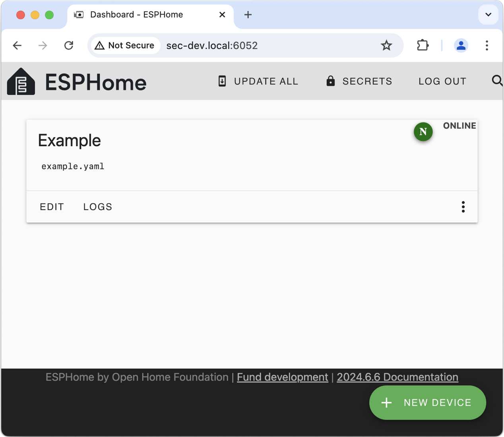

## Getting a clean slate

If ESPHome misbehaves or your early experiments leave a lot of clutter behind, and you decide it would be best to start over with a clean installation, run the commands below:

``` console
$ cd ~/IOTstack
$ docker-compose down esphome
$ sudo rm -rf ./volumes/esphome
$ docker-compose up -d esphome
```

Notes:

1. Always be careful with `sudo rm`. Double-check the command **before** you press <kbd>enter</kbd>.
2. The `sudo rm` may seem to take longer than you expect. Do not be concerned. ESPHome downloads a lot of data which it stores at the hidden path:

	```
	/IOTstack/volumes/esphome/config/.esphome
	```

	A base install has more than 13,000 files and over 3,000 directories. Even on a solid state disk, deleting that meny directory entries takes time!

## Device mapping

### UDEV rules file {#udevRules}

The [service definition](#serviceDefinition) contains the following lines:

``` yaml linenums="14"
  device_cgroup_rules:
    - 'c 188:* rw'
```

Those lines assume the presence of a rules file at:

```
/etc/udev/rules.d/88-tty-iotstack-esphome.rules
```

That file is copied into place automatically if you use the IOTstack menu to select ESPHome. It should also have been copied if you [installed ESPHome manually](#manualInstall).

What the rules file does is to wait for you to connect any USB device which maps to a major device number of 188. That includes most (hopefully all) USB-to-serial adapters that are found on ESP dev boards, or equivalent standalone adapters such as those made by Future Technology Devices International (FTDI) and Silicon Laboratories Incorporated where you typically connect jumper wires to the GPIO pins which implement the ESP's primary serial interface.

Whenever you **connect** such a device to your Raspberry&nbsp;Pi, the rules file instructs the ESPHome container to add a matching node. Similarly, when you **remove** such a device, the rules file instructs the ESPHome container to delete the matching node. The **container** gains the ability to access the USB device (the ESP) via the `device_cgroup_rules` clause.

You can check whether a USB device is known to the container by running:

``` console
$ docker exec esphome ls /dev
```

The mechanism is not 100% robust. In particular, it will lose synchronisation if the system is rebooted, or the container is started when a USB device is already mounted. Worst case should be the need to unplug then re-plug the device, after which the container should catch up.

#### Removing the rules file {#udevRulesRemoval}

The UDEV rules "fire" irrespective of whether or not the ESPHome container is actually running. All that happens if the container is not running is an error message in the system log. However, if you decide to remove the ESPHome container, you should remove the rules file by hand:

``` console
$ sudo rm /etc/udev/rules.d/88-tty-iotstack-esphome.rules
```

### Privileged mode {#privileged}

The [UDEV rules approach](#udevRules) uses the principle of least privilege but it relies upon an assumption about how ESP devices represent themselves when connected to a Raspberry&nbsp;Pi.

If you encounter difficulties, you can consider trying this instead:

1. Follow the instructions to [remove the UDEV rules file](#udevRulesRemoval).
2. Edit the [service definition](#serviceDefinition) so that it looks like this:

	``` yaml linenums="14"
	  x-device_cgroup_rules:
	    - 'c 188:* rw'
	  privileged: true
	```

	The `x-` prefix has the effect of commenting-out lines 14 and 15, making it easy to restore them later.

3. Start the container:

	``` console
	$ cd ~/IOTstack
	$ docker-compose up -d esphome
	```

The `privileged` flag gives the container unrestricted access to **all** of `/dev`. The container runs as root so this is the same as granting any process running inside the ESPHome container full and unrestricted access to **all** corners of your hardware platform, including your mass storage devices (SD, HD, SSD). You should use privileged mode *sparingly* and in full knowledge that it is entirely at your own risk! 

## Routine maintenance

You can keep ESPHome up-to-date with routine “pull” commands:

``` console
$ cd ~/IOTstack
$ docker-compose pull
$ docker-compose up -d
$ docker system prune -f
```

If a `pull` downloads a more-recent image for ESPHome, the subsequent `up` will (logically) disconnect any connected ESP device from the container.

The same will happen if you “down” and “up” the ESPHome container, or reboot the Raspberry&nbsp;Pi, while an ESP device is physically connected to the Raspberry&nbsp;Pi.

> In every case, the device will still be known to the Raspberry&nbsp;Pi, just not the ESPHome container. In a logical sense, the container is “out of sync” with the host system.

If this happens, disconnect and reconnect the device. The [UDEV rule](#udevRules) will “fire” and propagate the device back into the running container.
