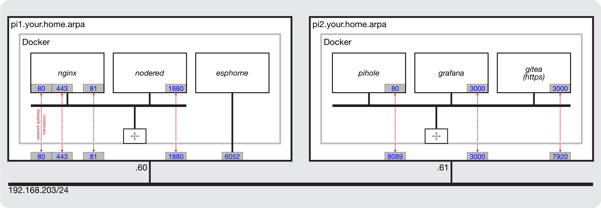

# Nginx

Nginx is a reverse proxy service. From the perspective of a client (browser), an Nginx server appears to be a standard web server but its behaviour is that of an intermediary, relaying client requests to the web service the client *actually* wants to reach.

## references

* Nginx:

	- [Documentation](https://nginxproxymanager.com)
	- [Dockerhub](https://hub.docker.com/r/jc21/nginx-proxy-manager)
	- [GitHub](https://github.com/NginxProxyManager/nginx-proxy-manager)

* [Let's Encrypt](https://letsencrypt.org)

* [Creating private self-signed SSL certificates](https://github.com/Paraphraser/ssl-certificates)

## default ports

The IOTstack implementation listens on the following ports:

* `80` the common front end for HTTP-based traffic
* `443` the common front end for HTTPS-based traffic
* `81` the administrative interface for Nginx

	> these are all "privileged" ports which means you may have trouble deploying this container in a "Docker Desktop" environment.

## environment variables

You can expect Nginx to work out of the box without any special configuration. The IOTstack service definition includes these environment variables:

``` yaml
environment:
  - TZ=${TZ:-Etc/UTC}
  - INITIAL_ADMIN_EMAIL=admin@example.com
  - INITIAL_ADMIN_PASSWORD=changeme
  - DISABLE_IPV6=true
```

Although you can change them if you wish, the email address and password only have effect on first launch, and only up until your first login when you are guided through the process of defining the first user and a (hopefully) stronger password.

Unless you have good reasons for enabling IPv6, it is recommended that you leave it disabled.

## reference model

The network model shown in [Figure 1](#figure1) will help you to understand how to configure Nginx.

| <a name="figure1"></a>Figure 1: Network Model                 |
|:-------------------------------------------------------------:|
| |

The model consists of two hosts, `pi1` and `pi2`. each of which is running three Docker containers. This model was constructed to show how you would set up Nginx to reach services running under various conditions. All these services could just as easily be running on a single computer and, rather than being hosted on physical computers (eg Raspberry Pi), the hosts could be implemented as a virtual guests in a Proxmox-VE system.

## domain name service

You **will** need a Domain Name System service to make effective use of Nginx. You can use implementations like Pi-hole, BIND9 (Berkeley Internet Name Daemon - the grandparent of all DNS servers) or any other equivalent service. Your DNS service can be native or running in a container. It can be private, public, on-site or off-site.

This document uses the domain `your.home.arpa` throughout. Substiute your own domain accordingly. This guide assumes a DNS service which can resolve the following resource records:

```
$ORIGIN your.home.arpa.

pi1           IN  A      192.168.203.60
pi2           IN  A      192.168.203.61

esphome       IN  CNAME  pi1.your.home.arpa.
gitea         IN  CNAME  pi1.your.home.arpa.
grafana       IN  CNAME  pi1.your.home.arpa.
nginx         IN  CNAME  pi1.your.home.arpa.
nodered       IN  CNAME  pi1.your.home.arpa.
pihole        IN  CNAME  pi1.your.home.arpa.
```

The above list uses BIND9 syntax. In words:

* all the names in the left-hand column imply `your.home.arpa`. For example:

	- `pi1` implies `pi1.your.home.arpa`.

* `pi1` and `pi2` are actual hosts which are reachable at the associated IP addresses (the "A" means "address"). For example:

	- `pi1.your.home.arpa` is reachable at 192.168.203.60

* the remaining names are aliases. That is, when presented with a domain name which maps to a CNAME record, the DNS also looks-up the corresponding A record. For example:

	- `esphome.your.home.arpa` looks up `pi1.your.home.arpa` and returns 192.168.203.60

In terms of Pi-hole:

* for versions 2024.07.0 and earlier, you manage:

	- `A` records via `Local DNS` » `DNS Records`; and
	- `CNAME` records via `Local DNS` » `CNAME Records`

* for later versions, `Settings` » `Local DNS Records` manages both `A` and `CNAME` records.

If you use another DNS server you will need to work it out for yourself.

## reverse proxy basics

When you type a URL like either of the following into the search bar of your browser:

```
http://esphome.your.home.arpa
https://esphome.your.home.arpa
```

1. The default port of 80 is assumed (for HTTP) or 443 (for HTTPS);
2. Via the `CNAME` lookup, the DNS supplies the IP adddress of the host `pi1` (192.168.203.60) so your client's system can direct IP datagrams to the host where the Nginx service is running;
3. The Nginx service listening on port 80 (or 443) on `pi1` still sees the original URL of:

	```
	http://esphome.your.home.arpa
	```

	and can use the **string** `esphome.your.home.arpa` to work out how to redirect the connection to the `esphome` **service** which, in this example, is running on the same host and is listening on port 6052.

## getting started

Nginx uses port 81 for its administrative interface. To manage Nginx you connect to the host where the Nginx service is running using port 81. For example:

```
http://pi1.your.home.arpa:81
```

Login with the default credentials:

* Email address: `admin@example.com`
* Password: `changeme`

You will be presented with an "Edit User" dialog where you should set the fields according to your requirements. That dialog is followed by a "Change Password" dialog where you enter `changeme` into the "Current Password" field, then supply a new password of appropriate strength.

See also [if you forget your password](#forgotPassword).

## add SSL certificate { #addCert }

Although it is not essential, it is a good idea to provision at least one SSL certificate before you start to use the Nginx reverse proxy manager. This is usually a so-called *wildcard* certificate, meaning it will authenticate hosts matching `*.your.home.arpa`. Nginx supports both [Let's Encrypt](https://letsencrypt.org) and private *self-signed* SSL certificates:

* The exact mechanisms for obtaining certificates from [Let's Encrypt](https://letsencrypt.org) are beyond the scope of this documentation. Google is your friend.

* See [Creating private self-signed SSL certificates](https://github.com/Paraphraser/ssl-certificates) for a guide to setting up and deploying a scheme of self-signed SSL certificates.

Once you have decided on your approach, use [Figure 2](#figure2) as your guide.

| <a name="figure2"></a>Figure 2: Add SSL certificate    |
|:------------------------------------------------------:|
| |

1. Click on the "SSL Certificates" tab <!--A-->&#x1F130;.
2. Click <kbd>Add SSL Certificate</kbd> <!--B-->&#x1F131; and choose one of the options <!--C-->&#x1F132;.
3. If you are provisioning a Let's Encrypt certificate:

	- fill in the fields <!--D-->&#x1F133; and <!--E-->&#x1F134;
	- optionally enable the DNS challenge <!--F-->&#x1F135;
	- agree to the Ts&Cs <!--G-->&#x1F136; and
	- click <kbd>Save</kbd> <!--H-->&#x1F137;.

4. If you are provisioning a self-signed certificate:

	- provide a name at <!--I-->&#x1F138; (eg "*.your.home.arpa")
	- click <kbd>Browse</kbd> <!--J-->&#x1F139;, then navigate to and select the private key associated with your wildcard certificate
	- click <kbd>Browse</kbd> <!--K-->&#x1F13A;, then navigate to and select your wildcard certificate
	- in most home networks you won't need to provide an intermediate certificate so you can leave that empty; and
	- click <kbd>Save</kbd> <!--L-->&#x1F13B;.

## adding hosts

Use [Figure 3](#figure3) as your guide.

| <a name="figure3"></a>Figure 3: Add proxy host      |
|:---------------------------------------------------:|
| |

1. Click on "Hosts" 	<!--A-->&#x1F130; and choose "Proxy Hosts" from the menu <!--B-->&#x1F131;.
2. Click <kbd>Add Proxy Host</kbd> <!--C-->&#x1F132;.
3. The "Details" tab <!--D-->&#x1F133; should be selected by default but, if not, select it.
4. In the "Domain Names" field <!--E-->&#x1F134;, type the fully-qualified **alias** (or "CNAME") name of the service. For example:

	```
	esphome.your.home.arpa
	```

	> There is a small trick to this. As you type the characters of the domain name, the name will be repeated in a drop-down menu below the field. Once you have finished typing the domain name *in* the field, click on the completed domain name in the drop-down menu *below* the field. 

5. [Table 1](#table1) shows how the "Scheme" <!--F-->&#x1F135;, "Forward Hostname or IP" <!--G-->&#x1F136; and "Forward Port" fields <!--H-->&#x1F137; should be completed.

	| <a name="table1"></a>Table 1: Nginx forwarding    |
	|:-------------------------------------------------:|
	| |

	The choice of *scheme* <!--F-->&#x1F135; depends on whether the *service* you are trying to provision expects HTTP or HTTPS. In the [reference model](#figure1), only `gitea` expects HTTPS; all the others expect HTTP.

	The general rules are:

	1. If Nginx is trying to reach itself, use `localhost` or 127.0.0.1 or the container name (`nginx`) and the internal (container) port where the administrative GUI is to be found.
	2. Nginx is a non-host-mode Docker container so if it is trying to reach:

		- another non-host-mode service on the *same* host then use the `«containerName»` and internal port. The example here is Node-RED.
		- a host-mode or native service on the *same* host then use the special name `host.docker.internal` and the host port on which the service is listening. The example here is ESPHome.
		- a service on a *different* host then use the fully-qualified domain name of that other host plus the external port (if the service is running in a non-host-mode container) or host port (if the service is either native or running in a host-mode container).

6. In almost all cases, you will want to enable "Websockets Support" <!--I-->&#x1F138;.
7. Switch to the "SSL" tab <!--J-->&#x1F139;.
8. The "SSL Certificate" field is a popup menu. Choose the relevant (or only) certificate you [provisioned earlier](#addCert).
9. If the destination service expects HTTPS traffic (ie the choice you made at <!--F-->&#x1F135;) you can also enable "Force SSL" <!--L-->&#x1F13B; to prevent attempts to use HTTP.
10. Click <kbd>Save</kbd> <!--M-->&#x1F13C;.

Each proxy host that you provision appears in the list. You can test connections locally by clicking on the service name in the "Source" column.

## container maintenance

You can maintain the Nginx container with normal `pull` commands:

``` console
$ cd ~/IOTstack
$ docker compose pull nginx
$ docker compose up -d nginx
$ docker system prune -f
```

## if you forget your password { #forgotPassword }

If you forget your password, you really only have two choices:

1. You can erase the persistent store and start from a [clean slate](#cleanSlate); or
2. You can attempt to replace your lost password with a known value.

To replace your password with a known value:

1. You will need the `whois` package:

	``` console
	$ sudo apt update && sudo apt install -y whois
	```

2. Define the following variables:

	``` console
	DB="$HOME/IOTstack/volumes/nginx/data/database.sqlite"
	EMAIL="user@domain"
	```

	where `user@domain` is the email address associated with the password you have forgotten. If you have also forgotten the email address, you can recover a list of email addresses by running:

	``` console
	$ sqlite3 "$DB" "SELECT email FROM user;"
	```

3. The `whois` package provides the `mkpasswd` utility, which you will use to generate a hash for your desired password:

	``` console
	$ HASH=$(mkpasswd -m bcrypt)
	Password: 
	```

	Type your desired password at the `Password:` prompt and press <kbd>return</kbd>. The hashed version of your password will be copied to the `HASH` environment variable.

4. Run the following command:

	``` console
	$ sudo sqlite3 "$DB" "UPDATE auth SET secret=\"$HASH\" WHERE user_id=(SELECT id FROM user WHERE email = \"$EMAIL\");"
	```

5. Restart the container:

	``` console
	$ cd ~/IOTstack
	$ docker compose restart nginx
	```

Providing you don't make any mistakes, the database will be updated with the hash corresponding with the desired password you typed in step 3. 

## starting over from a clean slate  { #cleanSlate }

Starting from a clean slate means you lose all the certificates and hosts you have provisioned. You will need to set up everything again from scratch.

Proceed as follows:

``` console
$ cd ~/IOTstack
$ docker compose down nginx
$ sudo rm -rf ./volumes/nginx
$ docker compose up -d nginx
```
